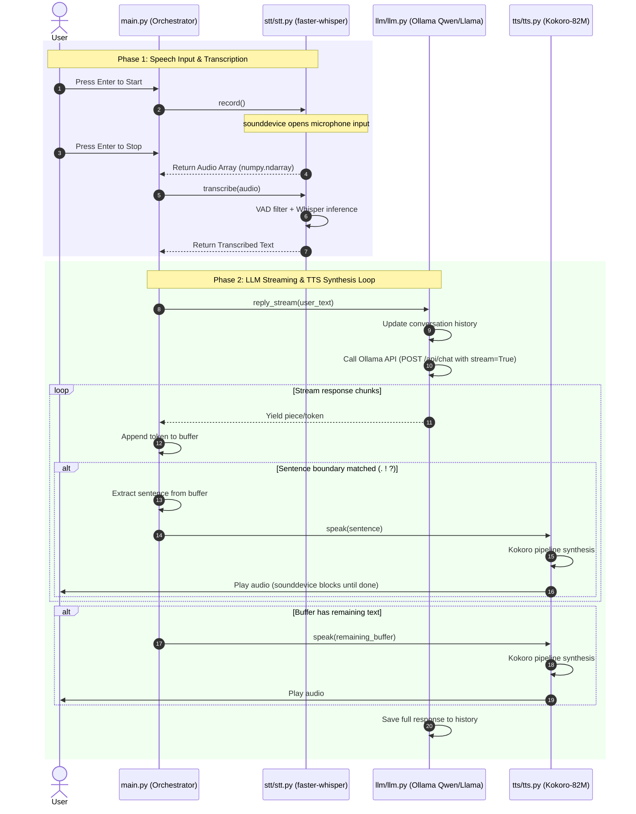

# MVP Voice Call Agent

A lightweight, fully local, free voice call agent pipeline using **STT ➔ LLM ➔ TTS** with real-time streaming:
1. **STT (Speech-to-Text)**: [faster-whisper](https://github.com/SYSTRAN/faster-whisper) (utilizing Whisper model variants)
2. **LLM (Language Model)**: Local [Ollama](https://ollama.com/) instance (e.g., `qwen2.5:3b` or `llama3.2:3b`)
3. **TTS (Text-to-Speech)**: [Kokoro-82M](https://huggingface.co/hexgrad/Kokoro-82M) via `kokoro` (highly efficient and human-like voice synthesis)

The core orchestrator splits the LLM stream into sentences on-the-fly and plays them immediately, minimizing conversation latency.

---

## 🏗️ Architecture & Interaction Flow

The following diagrams illustrate how the modules interact:

### System Architecture Flowchart

```mermaid
flowchart TB
    %% Styling
    classDef main fill:#f5f7ff,stroke:#5c7cfa,stroke-width:2px,color:#333;
    classDef stt fill:#eefaf0,stroke:#3b5bdb,stroke-width:1px,color:#333;
    classDef llm fill:#f3f0ff,stroke:#845ef7,stroke-width:1px,color:#333;
    classDef tts fill:#fff0f6,stroke:#e64980,stroke-width:1px,color:#333;
    classDef client fill:#fff9db,stroke:#f59f00,stroke-width:2px,color:#333;
    classDef external fill:#f8f9fa,stroke:#495057,stroke-width:1px,color:#333;
    classDef config fill:#f1f3f5,stroke:#868e96,stroke-dasharray: 5 5,color:#495057;

    subgraph Client ["Client & Hardware Layer"]
        User([User])
        Mic[Microphone / Input Stream]
        Speaker[Speaker / Output Stream]
    end
    class User,Mic,Speaker client;

    subgraph Orchestrator ["Orchestrator (main.py)"]
        Loop[Control Loop]
        Buffer[Sentence Splitter Buffer]
    end
    class Loop,Buffer main;

    subgraph STT_Mod ["Speech-To-Text (stt/stt.py)"]
        STT_Class[STT Class]
        Whisper[faster-whisper Model]
    end
    class STT_Class,Whisper stt;

    subgraph LLM_Mod ["LLM Layer (llm/llm.py)"]
        LLM_Class[LLM Class]
        History[(Conversation History)]
        SystemPrompt[System Persona Prompt]
    end
    class LLM_Class,History,SystemPrompt llm;

    subgraph TTS_Mod ["Text-To-Speech (tts/tts.py)"]
        TTS_Class[TTS Class]
        Kokoro[Kokoro-82M Pipeline]
    end
    class TTS_Class,Kokoro tts;

    subgraph Ext ["Local Services"]
        Ollama[Ollama API Server]
    end
    class Ollama external;

    subgraph Config_Mod ["Configuration (config/config.py)"]
        ConfigSettings[STT, LLM, & TTS Knobs]
    end
    class ConfigSettings config;

    %% Configuration Connections
    ConfigSettings -.-> STT_Class
    ConfigSettings -.-> LLM_Class
    ConfigSettings -.-> TTS_Class

    %% Interactive Loop Flows
    User -- "1. Press Enter to speak" --> Loop
    Loop -- "2. Record from mic" --> STT_Class
    STT_Class -- "sounddevice InputStream" --> Mic
    STT_Class -- "3. Transcribe audio" --> Whisper
    Whisper -- "4. User Text" --> STT_Class
    STT_Class -- "5. Return transcribed text" --> Loop
    
    Loop -- "6. Stream user text" --> LLM_Class
    LLM_Class -- "Prune history" --> History
    LLM_Class -- "Inject persona" --> SystemPrompt
    LLM_Class -- "7. Chat stream request" --> Ollama
    Ollama -- "8. Yield token chunks" --> LLM_Class
    LLM_Class -- "9. Yield pieces" --> Loop
    
    Loop -- "Buffer pieces" --> Buffer
    Buffer -- "10. Split complete sentences" --> Loop
    
    Loop -- "11. Speak sentence" --> TTS_Class
    TTS_Class -- "12. Generate audio" --> Kokoro
    TTS_Class -- "13. Play audio" --> Speaker
```


### Interaction Sequence Diagram


---

## 🛠️ Project Structure
```text
├── README.md               # Project documentation
├── project.mermaid         # Standalone Mermaid source file
├── main.py                 # Application orchestrator & control loop
├── config/
│   ├── __init__.py
│   └── config.py          # Configuration parameters (models, devices, etc.)
├── stt/
│   ├── __init__.py
│   └── stt.py             # Push-to-talk recording + faster-whisper module
├── llm/
│   ├── __init__.py
│   └── llm.py             # Ollama chat integration & history buffer
└── tts/
    ├── __init__.py
    └── tts.py             # Kokoro-82M pipeline & audio playback module
```

---

## ⚙️ Configuration & Customization
All runtime knobs are located in `config/config.py`. Here you can customize:
* **STT**: Model size (`small.en`, `base.en`, etc.) and hardware device (`cpu` or `cuda`).
* **LLM**: Model selection (`qwen2.5:3b`, `llama3.2:3b`), Ollama API endpoint, max token limits, and temperature.
* **TTS**: Kokoro voice presets (`af_heart`, etc.) and playback speed.
* **Conversation**: Size of the history context window (`MAX_HISTORY_TURNS`).

---

## 🚀 Setup & Execution

### 1. Requirements
Ensure you have the following installed:
* Python 3.10+
* [Ollama](https://ollama.com/) running locally:
  ```bash
  ollama pull qwen2.5:3b
  ```
* System libraries for audio:
  * On Linux/Debian: `sudo apt-get install portaudio19-dev libasound2-dev`

### 2. Installation
Install the Python package and its dependencies using `uv` (recommended) or `pip`:
```bash
uv pip install -e .
```
*(Dependencies include `sounddevice`, `numpy`, `faster-whisper`, `kokoro`, and `requests`)*

### 3. Run the Agent
Start the voice agent in your terminal:
```bash
python main.py
```
1. Press **Enter** to start recording your voice.
2. Speak your message.
3. Press **Enter** again to stop recording.
4. The agent will transcribe your voice, retrieve responses in stream from your local LLM, and synthesize/play audio chunks sentence-by-sentence in real-time.
