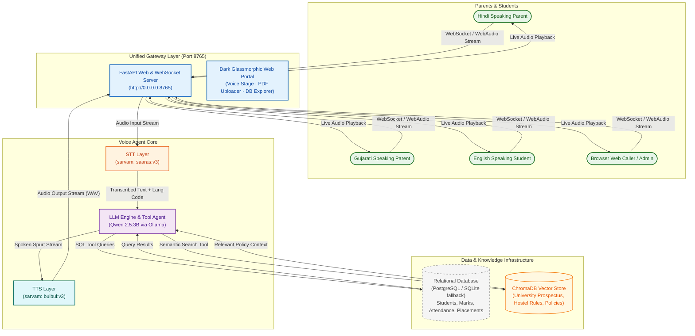

# 🎓 University Admission & Student Info Voice Agent & Knowledge Portal

A multi-lingual voice call agent and AI document intelligence portal for university admissions, student academic assistance, and campus policy inquiries. Callers and parents can interact via **WebSockets** or the **in-browser Web Portal** to ask about:
- **Admission Process, Eligibility, Fees, & Deadlines**
- **University Achievements & Department Placements**
- **Student Academic Marks & Subject-wise Attendance** (via database tool calling)
- **Hostel Rules, Curfew Timings, Scholarships, & Code of Conduct** (via PDF RAG vector store)

The agent speaks and understands naturally in **English (`en-IN`)**, **Hindi (`hi-IN`)**, and **Gujarati (`gu-IN`)**.

---

## 🏗️ System Architecture



---

## 🛠️ Technology Stack

| Layer | Provider / Tool | Description |
|---|---|---|
| **Web Portal & Gateway** | `FastAPI`, `Uvicorn`, `WebSockets` | Single unified server serving REST APIs, Glassmorphic UI & real-time audio |
| **STT (Speech-to-Text)** | `sarvamai` (`saaras:v3`) | Multi-lingual speech recognition (EN, HI, GU) with language auto-tagging |
| **LLM Engine** | `qwen2.5:3b` (via Ollama) | Local conversational LLM with multi-step tool-calling for SQL DB & RAG |
| **TTS (Text-to-Speech)** | `sarvamai` (`bulbul:v3`) | Multi-lingual voice synthesis streamed sentence-by-sentence |
| **Relational Database** | `PostgreSQL` / `SQLite` | Structured storage for students, marks, attendance, placements, programs |
| **RAG Knowledge Base** | `ChromaDB`, `PyPDF`, `ONNX MiniLM` | PDF upload dropzone, sentence chunker, persistent semantic vector index |

---

## 🌟 Web Portal Features

1. **🎙️ Live Voice Call Stage**:
   - In-browser microphone calling with WebAudio API (16kHz PCM).
   - Dynamic pulsing neon canvas waveform visualizer.
   - Real-time conversation stream with auto-scrolling transcript chat bubbles.
   - Quick inquiry suggestion chips in English, Hindi, and Gujarati.

2. **📄 PDF Knowledge Base Manager (RAG)**:
   - Drag & drop PDF uploader with real-time extraction and chunking progress.
   - Document catalog table with pages, chunk counts, and deletion controls.
   - Interactive Semantic Search tester with similarity match percentage badges.

3. **🎓 University Database Explorer**:
   - High-level metric KPI cards (Enrolled Students, Programs, Placement Stats, Indexed Chunks).
   - Student academic records with subject-wise marks and attendance.
   - Placement packages (highest/average LPA) and top hiring companies.
   - Degree programs, annual tuition fees, and application deadlines.

4. **⚙️ System Diagnostics**:
   - Live health checks for Ollama LLM, Sarvam AI Voice Suite, Database connection mode, and ChromaDB vector store.

---

## 🧰 Available LLM Agent Tools

1. **`lookup_student(identifier)`**: Finds a student's ID, department, and semester.
2. **`get_student_marks(student_id)`**: Fetches subject-wise marks and grades.
3. **`get_student_attendance(student_id)`**: Fetches attendance records and percentages.
4. **`get_placement_stats(department)`**: Retrieves placement packages (LPA), placement rate %, and top recruiting companies.
5. **`get_admission_info(program)`**: Fetches eligibility criteria, tuition fees, and application deadlines.
6. **`search_university_docs(query)`**: Performs semantic vector search on uploaded PDF rulebooks, hostel regulations, and scholarship guidelines.

---

## 🚀 Setup & Execution

### 1. Requirements
- Python 3.10+ (Recommended: Python 3.12 with `uv`)
- [Ollama](https://ollama.com/) running locally with Qwen 2.5:
  ```bash
  ollama pull qwen2.5:3b
  ```

### 2. Environment Configuration
Export your Sarvam AI Key:
```bash
export SARVAM_API_KEY="YOUR_SARVAM_API_KEY"
```

### 3. Run the Unified Voice Agent & Web Portal

```bash
uv run python main.py
# or
python main.py
```
Open **`http://localhost:8765`** in your browser to access the Web Portal!

#### Alternative: Terminal Push-to-Talk Mode
```bash
python main.py --cli
```

---

## 💬 Example Voice Queries

- **Parent (Hindi):** *"आरव पटेल के मार्क्स और अटेंडेंस क्या है?"*
  - **Tool Executed:** `lookup_student("आरव पटेल")` -> `get_student_marks("STU101")` & `get_student_attendance("STU101")`
  - **Spoken Answer:** *"आरव पटेल को डेटा स्ट्रक्चर्स में 88 और डेटाबेस में 92 मार्क्स मिले हैं, और उनकी कुल उपस्थिति 90% है।"*

- **Prospective Student (English - RAG):** *"What is the hostel curfew timing and leave policy?"*
  - **Tool Executed:** `search_university_docs("hostel curfew timing leave policy")`
  - **Spoken Answer:** *"Hostels have a 9:30 PM curfew on weekdays and 10:30 PM on weekends. Night-out passes require an online request submitted 24 hours in advance."*

- **Parent (Gujarati):** *"B.Tech Computer Science ની ફી અને eligibility શું છે?"*
  - **Tool Executed:** `get_admission_info("CSE")`
  - **Spoken Answer:** *"B.Tech CSE માટે 10+2 માં ફિઝિક્સ, કેમિસ્ટ્રી અને મેથ્સ સાથે ઓછામાં ઓછા 60% હોવા જોઈએ અને વાર્ષિક ફી ₹2,50,000 છે."*
